# Obituaries Portal — High-Level Timeline Flowchart

> **How to view as an image**
> - **In VSCode:** right-click this file → *Open Preview* (requires the built-in Markdown Preview, which understands Mermaid). Or install *Markdown Preview Mermaid Support*.
> - **As PNG / SVG:** paste the block below into <https://mermaid.live> → *Actions* → *Download PNG / SVG*.
> - **Into Whimsical:** paste the Mermaid block into a Whimsical Flowchart via the AI import / Mermaid import option.
> - **Into a slide deck:** export PNG/SVG from mermaid.live and drop into PowerPoint / Keynote / Google Slides.

Each phase is one horizontal swimlane. Tasks flow left-to-right within a lane. Phases stack top-to-bottom. Only first-level tasks are shown; the sub-bullets from `timeline-whimsical.md` are intentionally omitted.

```mermaid
%%{init: {"flowchart": {"defaultRenderer": "elk"}} }%%
flowchart TB

    %% ── Phase 1 · Discovery ──
    subgraph DISCOVERY["Phase 1 · Discovery Kickoff  ·  Weeks 1–3"]
      direction LR
      D1["Stakeholder<br/>Alignment"] --> D2["Scope<br/>Ratification"] --> D3["Commercial &<br/>Compliance"] --> D4["Technical<br/>Readiness"] --> D5["Pilot Cohort<br/>Identified"]
    end

    %% ── Phase 2 · Build ──
    subgraph BUILD["Phase 2 · Agile Develop / Test  ·  Weeks 4–29  ·  Sprints 1–13"]
      direction LR
      B1["Foundation &<br/>Ramp-up<br/>(Sprints 1–2)"] --> B2["Connect Custom<br/>Onboarding<br/>(Sprints 3–4)"] --> B3["Listings &<br/>Pre-Pay Invoicing<br/>(Sprints 5–6)"] --> B4["Monthly Aggregation<br/>& Billing<br/>(Sprints 7–8)"] --> B5["Loyalty &<br/>Stripe Issuing<br/>(Sprints 9–10)"] --> B6["Exception Handling<br/>& Ops Console<br/>(Sprints 11–12)"] --> B7["Hardening<br/>(Sprint 13)"]
    end

    %% ── Phase 3 · UAT ──
    subgraph UAT["Phase 3 · Acceptance / UAT  ·  Weeks 30–33"]
      direction LR
      U1["Preparation"] --> U2["Execution"] --> U3["Sign-off"]
    end

    %% ── Phase 4 · Rollout ──
    subgraph ROLLOUT["Phase 4 · Rollout  ·  Weeks 34–40"]
      direction LR
      R1["Pre-flight"] --> R2["Pilot<br/>Go-live"] --> R3["Pilot<br/>Stabilisation"] --> R4["Progressive<br/>Rollout (GA)"]
    end

    %% ── Vertical handoffs: last node of one phase → first node of next ──
    D5 ==> B1
    B7 ==> U1
    U3 ==> R1

    %% ── Node styling per phase ──
    classDef discovery fill:#E8F1FF,stroke:#2F6FEB,stroke-width:1px,color:#0B2A66;
    classDef build fill:#EAF7EE,stroke:#2F9E4F,stroke-width:1px,color:#1A4A2A;
    classDef uat fill:#FFF6E5,stroke:#D39B00,stroke-width:1px,color:#5A4300;
    classDef rollout fill:#FCEBF1,stroke:#C2185B,stroke-width:1px,color:#5E0E31;

    class D1,D2,D3,D4,D5 discovery;
    class B1,B2,B3,B4,B5,B6,B7 build;
    class U1,U2,U3 uat;
    class R1,R2,R3,R4 rollout;

    %% ── Swimlane styling ──
    style DISCOVERY fill:#F5F9FF,stroke:#2F6FEB,stroke-width:1.5px,color:#0B2A66
    style BUILD fill:#F5FBF7,stroke:#2F9E4F,stroke-width:1.5px,color:#1A4A2A
    style UAT fill:#FFFBF2,stroke:#D39B00,stroke-width:1.5px,color:#5A4300
    style ROLLOUT fill:#FEF4F7,stroke:#C2185B,stroke-width:1.5px,color:#5E0E31
```

> **Why the `elk` renderer?** Mermaid's default `dagre` renderer often routes inter-subgraph arrows across the diagram rather than vertically between stacked swimlanes. The `elk` layered algorithm respects subgraph stacking and draws the phase handoffs as clean downward arrows. If your Mermaid viewer pre-dates elk support (added in Mermaid v10.3), remove the `%%{init}%%` line and the layout will fall back to dagre — still correct, just less tidy.

---

## Notes on what's included / excluded

- **Included (first-level tasks only):** the 5 Discovery tracks, the 7 sprint clusters inside Build, the 3 UAT tracks, the 4 Rollout tracks.
- **Omitted deliberately:** second-level detail such as *Client exec kickoff*, individual story IDs, defect-triage standup, cohort counts. These live in [timeline-whimsical.md](timeline-whimsical.md).
- **Omitted intentionally:** parallel workstreams (Stripe KYB, platform-team tickets) — they cut across every phase and would clutter a horizontal swimlane view. If you want them rendered as a 5th "critical-path" lane beneath the four delivery lanes, say the word and I'll add it.
